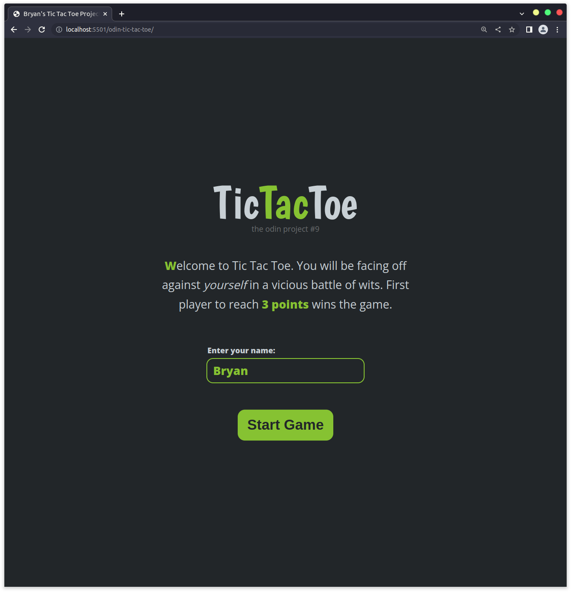
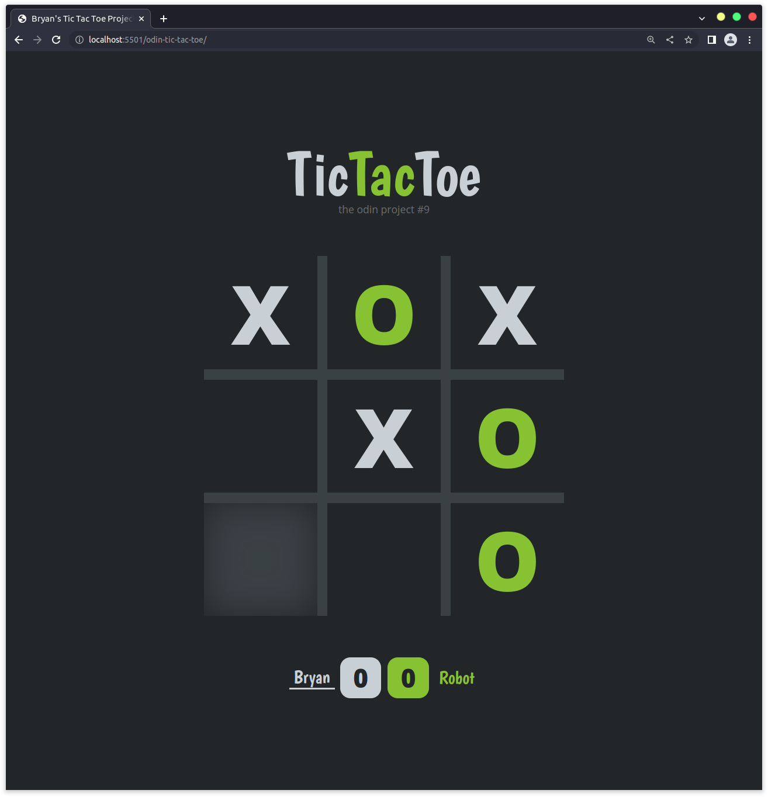
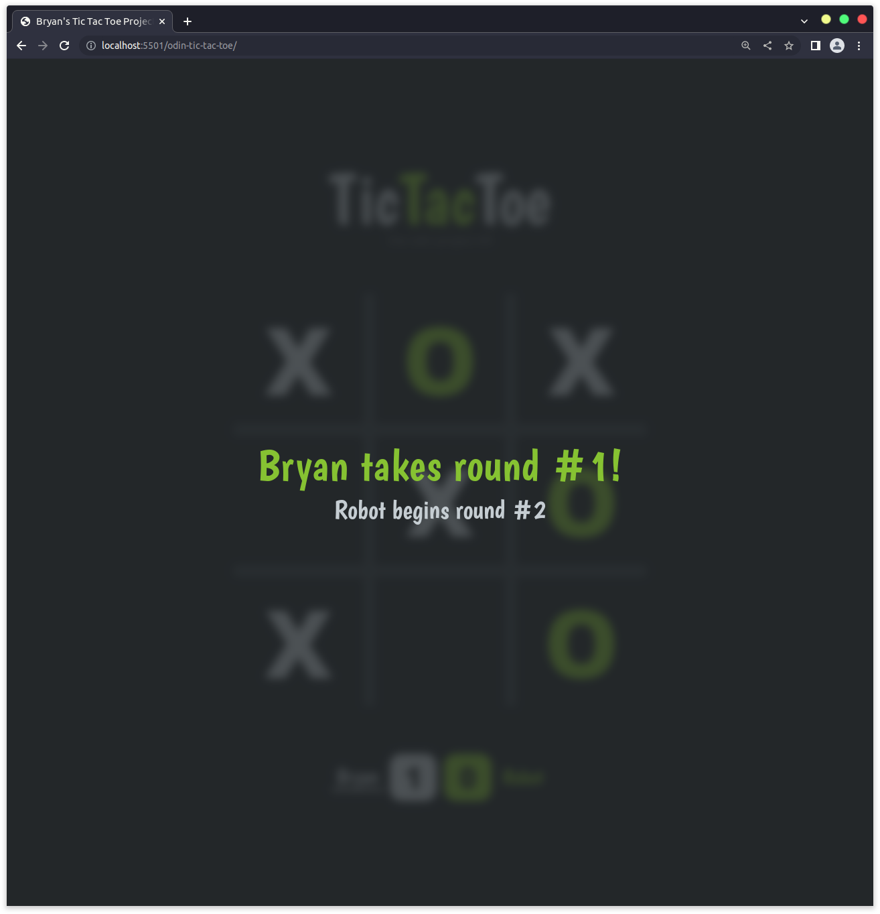

# Odin Project #9: Tic Tac Toe

Welcome to Bryan Miller's Tic Tac Toe Project, the [ninth assignment](https://www.theodinproject.com/lessons/node-path-javascript-tic-tac-toe) within the Odin Project curriculum. The goal of this repo is to practice the following skill sets:

- JavaScript
  - Module Design Pattern
  - Factory Functions
  - Scope & Closure
  - Namespacing
  - `transitionend` Event & `{once: true}` option
- HTML
- CSS
  - Transitions: Opacity & Display None

## Summary

Modular design pattern & factory functions were the core lessons practiced in this project and I have to say that I'm a huge fan. Modular design allows us to keep the global namespace tidy and selectively allow variables & methods to poke through, much like a firewall. Factory functions, an alternative to constructor functions, eliminate the use of the `new` keyword when instantiating objects and allow us to explicitly define how our objects are to behave.

Using these skill sets, here is how I designed a game of Tic Tac Toe:

### GameBoard Module

The `GameBoard` module is responsible for:

- Keeping track of the gameboard & marker placement: `_boardArray`
- Displaying it on page: `render()`
- Resetting the gameboard elements & array: `reset()`
- Controlling interactivity with its clickable squares: `EventHandlers` & the `selectSquare` callback function

The `GameBoard` restricts global access to `get()` & `reset()`.

The `GameBoard` on its own is useless, until a square is clicked. From there, it reaches out to the `Game` flow module, whos responsibility is to find out who's turn it is, which marker to display and if a winner is present.

### DisplayController

The `DisplayController` module is responsible for:

- Updating GUI elements on the page
- Controlling game menu, input box & button
- Transitions between screens
- Displaying the modal

### Game Flow Module

The `Game` Flow module contains the core functionality of the game. It:

1. Creates player objects by invoking the `playerFactory()` factory functions
1. Dictates the flow of the game

### playerFactory Factory Function

Lastly, the `playerFactory()` Factory Function is responsible for creating player objects. These objects contain:

- Player's name
- Player's marker
- Player's score
- Functions for getting name, marker, score (preventing direct manipulation)
- Functions for incrementing score & resetting score

In summary, this was a fantastic project that taught me the importance of the `transitionend` event and the `{once: true}` option for chaining CSS animations together. With their help, it allowed me to minimize the number of active `EventListeners`, keeping resource consumption to a minimum.

## Links

- [Live Demo](https://bmilcs.github.io/odin-tic-tac-toe/)
- [My Odin Project Progress](https://github.com/bmilcs/odin-project)

## Screenshots





## Deployment

```sh
git clone https://github.com/bmilcs/odin-tic-tac-toe
```
